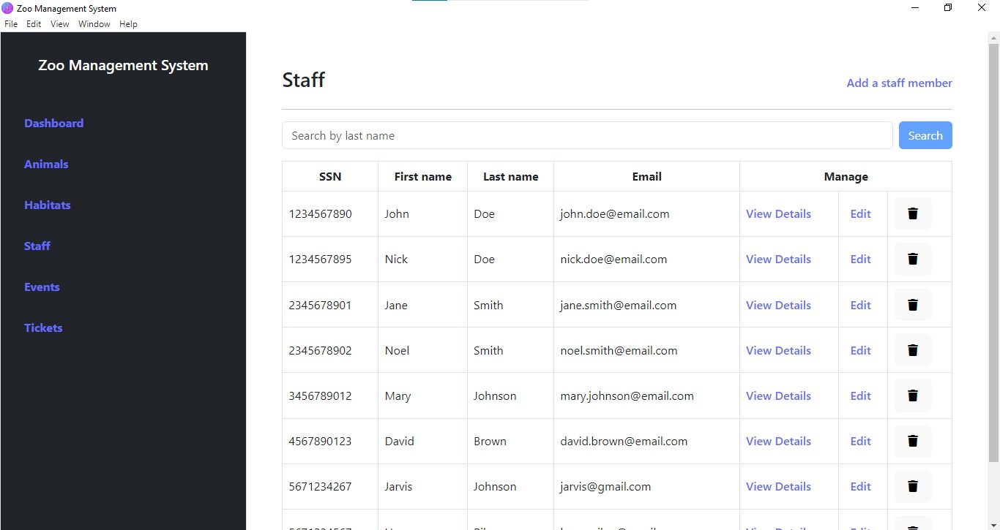

# Zoo Management System

A zoo management system developed for the course project of the Database Systems course that uses Electron, React, Vite, and MySQL.

The application connects to a local MySQL and offers a clear minimalistic interface to interact with the database.


## Installation

To install the application, clone the repository and install the dependencies:

```sh
git clone https://github.com/1ilit/zoo-management-system.git
cd zoo-management-system

npm install
```

Set up your database credentials in a `.env` file following the example in `.env.sample`.


## Usage

To start the application

```sh
npm run dev
```


## Build

To build

```sh
npm run build
```


## Demo

